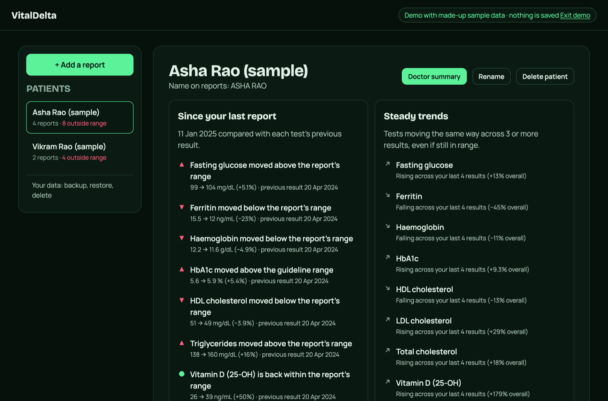
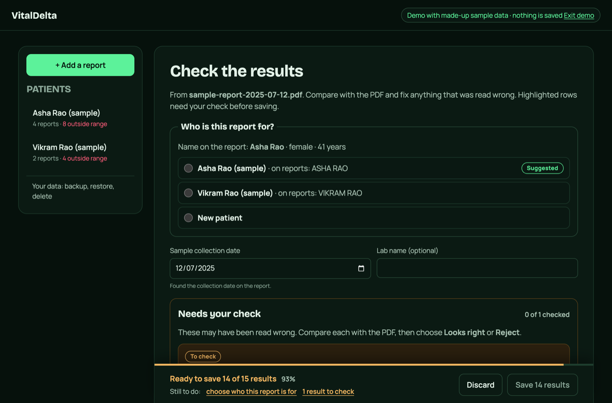
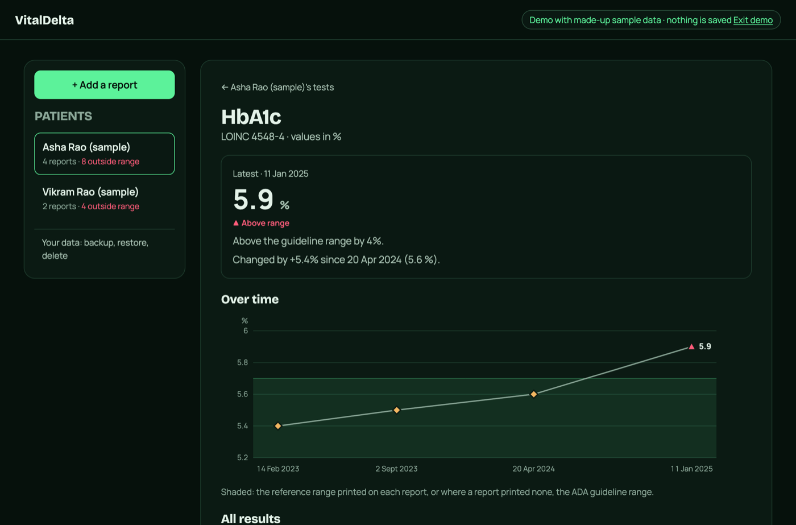
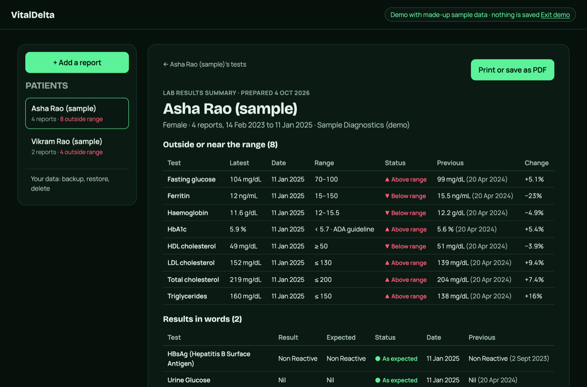
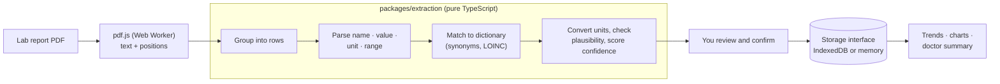

# VitalDelta

**See how your lab results change over time.** VitalDelta reads lab report PDFs in your
browser, pulls out the values, and lines them up across reports, so you can walk into a
doctor's visit with one page showing what changed and what's outside the range.

**[vitaldelta.app](https://vitaldelta.app)** · [Try the demo](https://vitaldelta.app/app?demo=1) (made-up data, nothing saved) · Free and open source (MIT)



## Your reports never leave your device

There is no server and no account. PDFs are read by JavaScript in your browser and results
are stored in your browser's IndexedDB. You don't have to take that on trust: the site's
[Content Security Policy](apps/web/vercel.json) sets `connect-src 'self'`, so the browser
itself blocks any request that could send data to another server. No analytics, no
trackers, no cloud OCR or AI calls.

- **Works offline** once loaded, and installs as an app (PWA).
- **Shared computer?** Choose *Just this session*: nothing is written to disk, and closing the tab erases it.
- **Backup** is a JSON file you export and keep; *Delete all data* wipes everything the site stored.

## What it does

- **Reads any lab's PDF**: no per-lab templates. It finds the rows, matches test names
  against a dictionary of 71 tests (with LOINC codes and the many names labs print),
  converts units, and reads the reference range printed on the report.
- **You confirm every value.** Rows it's unsure about are highlighted for a check before saving.
- **Tracks each test over time**, with a chart and the report's range shaded behind it.
- **Shows what changed since the last report**: newly outside the range, back in range,
  large moves, and steady trends across three or more results that are still in range.
- **Doctor summary**: a one-page printable table of what's outside or near the range.
- **Results in words** too ("Non Reactive", "Nil"), compared with the expected result on the same report.
- **Guideline ranges as a fallback**: when a report prints no range for HbA1c, glucose,
  cholesterol, eGFR, hs-CRP or vitamin D, it uses the published guideline (ADA, NCEP, KDIGO…)
  and says so. See [docs/dictionary.md](docs/dictionary.md).
- **Several patients**, e.g. you and your parents, with the name on each report suggested.

It never diagnoses: it says "above the report's range" or "changed by 12%", never what that might mean.
It isn't medical advice; talk to your doctor about your results.

| Checking a new report | One test over time | Doctor summary |
|---|---|---|
|  |  |  |

**Not yet supported:** scanned or photographed reports (no text layer, so they need OCR), and
more than one PDF per upload.

## How it works



Everything in the diagram runs in the browser. Extraction is a separate package with no DOM
or React, so a future mobile app can reuse it.

| Path | What's there |
|---|---|
| `apps/web` | Vite + React + TypeScript PWA, deployed on Vercel |
| `packages/extraction` | PDF text → rows → results; the test dictionary; trend and range logic |
| `docs/` | [Plan](docs/PLAN.md), [dictionary rules](docs/dictionary.md), [gotchas](docs/GOTCHAS.md) |

## Development

Needs Node 22+ and pnpm.

```sh
pnpm install
pnpm dev          # http://localhost:5173
pnpm test         # unit tests
pnpm lint && pnpm typecheck
pnpm e2e          # builds, then drives headless Chrome through the app with the real CSP
pnpm harness      # match rate across your own PDFs in fixtures/
```

`fixtures/` is gitignored because real reports are personal health data. Put your own PDFs
there to run the harness; its output never prints names or report text.

## Contributing

The most useful contribution is a **test name your lab prints that VitalDelta didn't
recognise**: add it as a synonym in
[`dictionary.json`](packages/extraction/src/dictionary.json) following
[docs/dictionary.md](docs/dictionary.md), with an example of how it's printed. Please never
attach a real report to an issue or pull request; describe the layout or make a synthetic one.

Read [AGENTS.md](AGENTS.md) for the project's non-negotiables (no network requests, no
diagnosis wording, no per-lab templates) and [docs/GOTCHAS.md](docs/GOTCHAS.md) before
changing PDF reading or extraction.

## License

[MIT](LICENSE).

This material contains content from LOINC® (https://loinc.org). LOINC is copyright ©
Regenstrief Institute, Inc. and the Logical Observation Identifiers Names and Codes (LOINC)
Committee and is available at no cost under the license at https://loinc.org/license.
LOINC® is a registered United States trademark of Regenstrief Institute, Inc.
